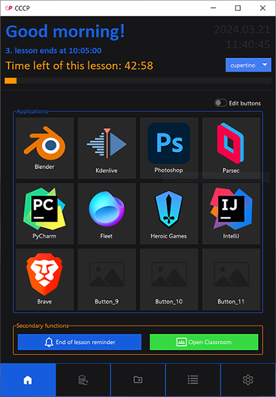

<p align=center>
  
</p>
<h1 align=center>Complex Computer Controlling Program</h1>


## What is CCCP?

CCCP is a compact portable program designed for your USB drive,
packed with powerful features. Launch applications, create backups,
generate files, and much more, all from your portable drive.
Experience convenience and productivity on the go with CCCP.

## Installation
- Download project
    - Install [ python ](https://www.python.org/downloads/) if you dont have it

    - Install [ttkbootstrap](https://github.com/israel-dryer/ttkbootstrap)

    ```python
    python -m pip install ttkbootstrap
    ```
- Or download project build
## Main features
- Launch applications, project files, etc.
    - You can give each application a unique: name, icon
    
    
    
- Create backups to your USB drive

    

    

- Copy config files to and from computer
    
    

- To-do list
    
    

- Generate project folders and much more!

## Themes
CCCP comes with 23 different dark and light themes, thanks to [ttkbootstrap](https://github.com/israel-dryer/ttkbootstrap).
You can create your own custom themes using [TTK Creator](https://ttkbootstrap.readthedocs.io/en/latest/themes/themecreator/).


## Links
-__ttkbootstrap__: https://github.com/israel-dryer/ttkbootstrap   
-__Github__: https://github.com/robothaver  
