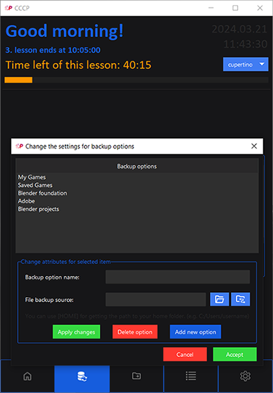

# Complex Computer Controlling Program
<p align=center>
  
</p>

## What is CCCP?

CCCP (Complex Computer Controlling Program) is a compact program designed for your USB drive,
packed with powerful features. Launch applications, create backups,
generate files, set reminders, and much more, all from your portable drive.
Experience convenience and productivity on the go with CCCP.


## Installation
- Download project
    - Install [ python ](https://www.python.org/downloads/) if you dont have it

    - Install [ttkbootstrap](https://github.com/israel-dryer/ttkbootstrap)

    ```python
    python -m pip install ttkbootstrap
    ```
- Or download project build
## Main features
- Launch applications, project files, and much more from your USB drive
    - Give each application unique: name, icon, path to file

    
    
- Create backups to USB drive

    

    

- Copy save files to and from computer
    
    

- To-do list!
    
    

- Generate project folders and much more!

## Themes
CCCP comes with 18 different dark and light themes, thanks to [ttkbootstrap](https://github.com/israel-dryer/ttkbootstrap).


## Links
-__ttkbootstrap__: https://github.com/israel-dryer/ttkbootstrap   
-__Github__: https://github.com/robothaver  
